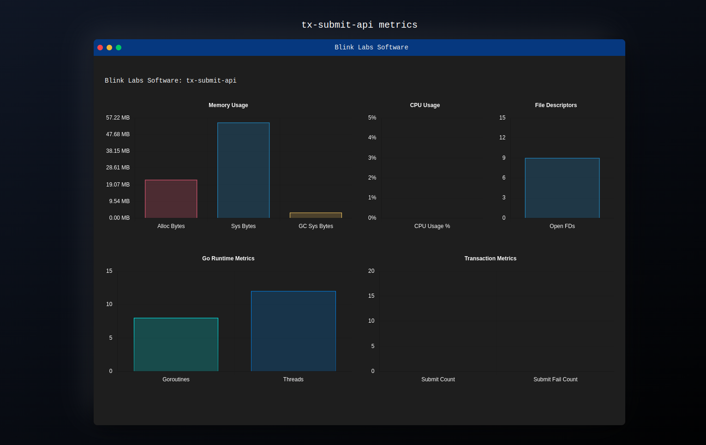

# tx-submit-api

<div align="center">
    
</div>

Transaction Submission API for Cardano

A simple HTTP API which accepts a CBOR encoded Cardano transaction as a
payload body and submits it to a Cardano full node using the Ouroboros
LocalTxSubmission Node-to-Client (NtC) protocol.

## Usage

The recommended method of using this application is via the published
container images, coupled with Blink Labs container images for the Cardano
Node.

```
docker run -p 8090:8090 ghcr.io/blinklabs-io/tx-submit-api
```

Binaries can be executed directly and are available from
[Releases](https://github.com/blinklabs-io/tx-submit-api/releases).

```
./tx-submit-api
```

### Configuration

Configuration can be done using either a `config.yaml` file or setting
environment variables. Our recommendation is environment variables to adhere
to the 12-factor application philisophy.

#### Environment variables

Configuration via environment variables can be broken into two sets of
variables. The first set controls the behavior of the application, while the
second set controls the connection to the Cardano node instance.

Application configuration:
- `API_LISTEN_ADDRESS` - Address to bind for API calls, all addresses if empty
    (default: empty)
- `API_LISTEN_PORT` - Port to bind for API calls (default: 8090)
- `DEBUG_ADDRESS` - Address to bind for pprof debugging (default: localhost)
- `DEBUG_PORT` - Port to bind for pprof debugging, disabled if 0 (default: 0)
- `LOGGING_HEALTHCHECKS` - Log requests to `/healthcheck` endpoint (default: false)
- `LOGGING_LEVEL` - Logging level for log output (default: info)
- `METRICS_LISTEN_ADDRESS` - Address to bind for Prometheus format metrics, all
    addresses if empty (default: empty)
- `METRICS_LISTEN_PORT` - Port to bind for metrics (default: 8081)

Connection to the Cardano node can be performed using specific named network
shortcuts for known network magic configurations. Supported named networks are:

- mainnet
- preprod
- preview
- testnet

You can set the network to an empty value and provide your own network magic to
connect to unlisted networks.

TCP connection to a Cardano node without using an intermediary like SOCAT is
possible using the node address and port. It is up to you to expose the node's
NtC communication socket over TCP. TCP connections are preferred over socket
within the application.

Cardano node configuration:
- `CARDANO_NETWORK` - Use a named Cardano network (default: mainnet)
- `CARDANO_NODE_NETWORK_MAGIC` - Cardano network magic (default: automatically
    determined from named network)
- `CARDANO_NODE_SKIP_CHECK` - Skip the connection test to Cardano Node on start
    (default: false)
- `CARDANO_NODE_SOCKET_PATH` - Socket path to Cardano node NtC via UNIX socket
    (default: /node-ipc/node.socket)
- `CARDANO_NODE_SOCKET_TCP_HOST` - Address to Cardano node NtC via TCP
   (default: unset)
- `CARDANO_NODE_SOCKET_TCP_PORT` - Port to Cardano node NtC via TCP (default:
    unset)
- `CARDANO_NODE_SOCKET_TIMEOUT` - Sets a timeout in seconds for waiting on
   requests to the Cardano node (default: 30)

### Connecting to a cardano-node

You can connect to either a cardano-node running locally on the host or a
container running either `inputoutput/cardano-node` or
`blinklabs-io/cardano-node` by mapping in the correct paths and setting the
environment variables or configuration options to match.

#### Together with blinklabs-io/cardano-node in Docker

Use Docker to run both cardano-node and tx-submit-api with Docker
volumes for blockchain storage and node-ipc.

```
# Start node
docker run --detach \
  --name cardano-node \
  -v node-data:/opt/cardano/data \
  -v node-ipc:/opt/cardano/ipc \
  -p 3001:3001 \
  ghcr.io/blinklabs-io/cardano-node run

# Start submit-api
docker run --detach \
  --name tx-submit-api
  -v node-ipc:/node-ipc \
  -p 8090:8090 \
  ghcr.io/blinklabs-io/tx-submit-api
```

#### Using a local cardano-node

Use the local path when mapping the node-ipc volume into the container to use
a local cardano-node.

```
# Start submit-api
docker run --detach \
  --name tx-submit-api \
  -v /opt/cardano/ipc:/node-ipc \
  -p 8090:8090 \
  ghcr.io/blinklabs-io/tx-submit-api
```

### Sending transactions

This implementation shares an API spec with IOHK's Haskell implementation. The
same instructions apply. Follow the steps to
[build and submit a transaction](https://github.com/input-output-hk/cardano-node/tree/master/cardano-submit-api#build-and-submit-a-transaction)

```
# Submit a binary tx.signed.cbor signed CBOR encoded transaction binary file
curl -X POST \
  --header "Content-Type: application/cbor" \
  --data-binary @tx.signed.cbor \
  http://localhost:8090/api/submit/tx
```

### Metrics UI

There is a metrics web user interface running on the service's API port.

Connect to [http://localhost:8090/ui/](http://localhost:8090/ui/) with your
browser to view it.

<div align="center">
    
</div>

## Development

There is a Makefile to provide some simple helpers.

Run from checkout:
```
go run .
```

Create a binary:
```
make
```

Create a docker image:
```
make image
```
